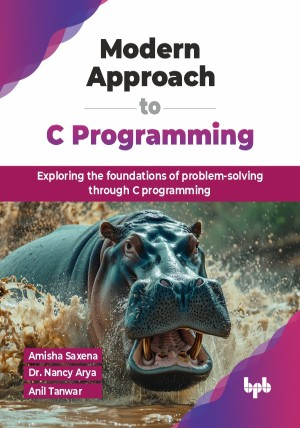

# Modern Approach to C Programming

Exploring the foundations of problem-solving through C programming.

This is the repository for [Modern Approach to C Programming
](https://bpbonline.com/products/modern-approach-to-c-programming?variant=44301628080328),published by BPB Publications.

## About the Book
C is a powerful and versatile programming language used for building everything from operating systems to video games. This book equips you with the essential knowledge to solve problems and create efficient programs using C.

This book provides a comprehensive guide to C programming, starting with the fundamentals of the C language and progressing to advanced topics. It begins by introducing the syntax, data types, operators, control flow statements, and functions. The book then delves into arrays and strings, two essential data structures in C programming. Subsequently, it explores advanced topics such as pointers, structures, unions, and file handling. This book will help readers have a solid understanding of C programming and be equipped to write efficient C programs.

By the end of this book, you will be a confident C programmer, ready to write effective code and solve real-world problems. The book provides you with the foundational skills and knowledge to approach programming challenges with a newfound sense of ease, paving the way for a rewarding career as a C programmer.

## What You Will Learn
• Apply operators and control structures to create efficient programs.

• Develop modular programs using functions for better code management.

• Work with arrays to store and manipulate large datasets.

• Use pointers for dynamic memory allocation and data manipulation.

• Handle file input/output to store and retrieve program data.
